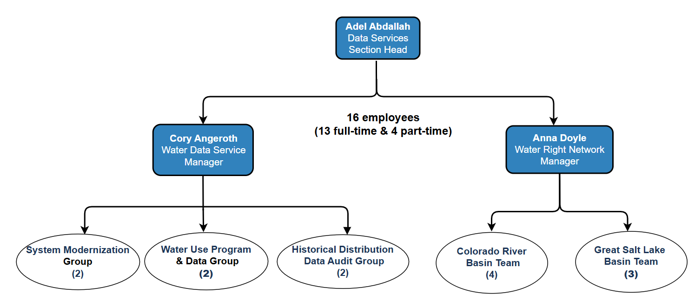

---
layout:
  width: default
  title:
    visible: true
  description:
    visible: true
  tableOfContents:
    visible: true
  outline:
    visible: true
  pagination:
    visible: true
  metadata:
    visible: true
---

# About

### Mission statement

> The Utah Division of Water Rights Data Services Section serves as the steward of Utah's water distribution and use data & the Water Right Network. Our mission is to enhance the data's Findability, Accessibility, Interoperability, and Reusability (FAIR) to ensure the clarity, transparency, certainty, and security of the state's valuable water resources.

### Directive

<strong>New Division of Water Rights Section</strong>

In January 2024, the Division created the Data Services Section and an Assistant State Engineer position dedicated to improving the quality of water-measurement data and advancing the Water Right Network. The Section was charged with implementing Legislative Audit recommendations centered on improving the Findability, Accessibility, Interoperability, and Reusability (FAIR) of water data. These efforts strengthen the clarity, transparency, certainty, and security of Utah’s water-resource information.

The State Engineer is responsible for supervising the measurement, appropriation, apportionment, and distribution of water across the state (Utah Code 73-2-1(3)(a)). For many decades, the Utah Division of Water Rights (DWRi) has collected and managed detailed water-use, flow measurement, and volume measurement data. Although widely used for operational decisions and accessible through the Division’s website, the 2023 Legislative Audit found that documentation, consistency, and interpretability needed improvement. As a result, the Division concluded that modernizing existing data systems is essential to meet statutory mandates and ensure water information supports a broad set of management needs. Utah law specifies that water is “the property of the public” (Utah Code 73-1-1), and because the Division is an office of public record (Utah Code 73-2-11), water-measurement data are also a public resource.&#x20;

### [Staff](./#staff)

Data Services Section Management Structure

he Data Services Section adopted existing staff from the Technical Services Section’s Water Use Program and the Water Right Network (WRN), and added new positions to support both teams. The Section has two managers: (1) Data Services Manager, who oversees the Water Use Program & Data Group, the Historical Distribution Data Audit Group, and the HydroServer Modernization Group; (2) the Water Right Network Manager directs development activities for the Colorado River Basin and Great Salt Lake Basin WRN areas.

<figure><figcaption></figcaption></figure>

### HydroServer: The Next-Gen Water Use and Distribution Data System

The Utah Division of Water Rights has partnered with Utah State University to conduct a hydroinformatics gap analysis and roadmap to identify and implement improvements in water data processes. Water data management includes all “stream to user screen” processes for measuring, collecting, transmitting, storing, quality-controlling, and making data available. Now, in our second year working with USU, learn what improvements are being made to the data processes and systems at the Division of Water Rights.

 

### The Water Right Network

The Data Services Section is currently developing the Water Right Network to help water planners, regulators, researchers, and interested citizens better understand how water moves throughout the state. The Water Right Network ties water use and water rights information to a geodatabase representing the state’s streams and canals, much like navigation apps tie the locations of homes and businesses to the transportation network. Learn about the features of the Water Right Network and how it will be used to address important water issues in the state.

